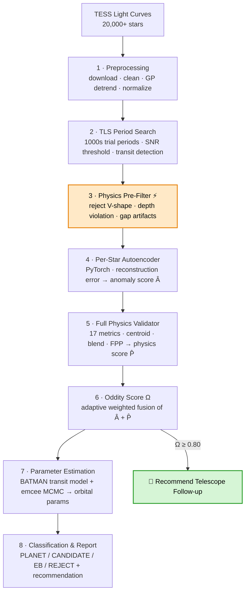

<div align="center">

# 🪐 PHAST
### Physics-Hardcoded Anomaly & Signal Taxonomy

**An automated, explainable pipeline that hunts for exoplanets in TESS light curves — by combining a per-star PyTorch autoencoder, hard physics rules, and MCMC parameter estimation into a single auditable verdict.**


*Built by **Team ExoScan**, PICT Pune — ISRO Bharatiya Antariksh Hackathon 2026*

</div>

---

## The Problem

Space telescopes like **TESS** stare at tens of thousands of stars at once and record how their brightness changes over time. When a planet passes in front of its star, the star dims by a fraction of a percent for a few hours — a *transit*. Find that dip, and you've found a world.

The catch: the data is a mess of star-spots, cosmic rays, spacecraft wobble, and instrument drift, and there are **200,000+ light curves**. No human can review them all. Existing automated pipelines flag thousands of Objects of Interest per sector — each one that turns out to be a false positive wastes expensive follow-up telescope time. What's needed is a system that is **automated** (no human in the loop for the first cut), **explainable** (it can say *why* it flagged or rejected something), and **scalable** (it runs on free hardware).

PHAST is that system.

---

## Why PHAST Is Different

Most detection pipelines lean on a single model and hand you a probability. PHAST runs two *independent* scientific judges, fuses them with adaptive weights, and does the cheap reasoning first.

🧠 **AI + Physics, fused — not chosen between.** A per-star PyTorch autoencoder scores how anomalous each transit dip is *for that specific star*. A 17-metric physics validator independently checks orbital mechanics, centroid shift, blend risk, and secondary eclipse. Both scores are fused into Oddity Score Ω. Neither can silently override the other.

⚡ **Physics before the heavy AI.** The core architectural move: a millisecond-fast physics pre-filter (pure NumPy) runs *before* the GPU-heavy autoencoder. It throws out obvious eclipsing binaries and depth-violation candidates first — so the autoencoder trains on ~200–400 clean candidates instead of ~1,000+ noisy ones. Roughly **5× less compute**, and cleaner unsupervised learning.

🔍 **Auditable by design.** Every rejection comes with a reason. A signal isn't just "0.31 probability" — it's "rejected: V-shape flag + odd/even depth mismatch + secondary eclipse detected." Every intermediate result is checkpointed as a structured file, inspectable at any stage without rerunning upstream work.

💸 **Zero infrastructure cost.** Every component is free and open-source and runs end-to-end on a single free Google Colab T4 GPU — or locally in VSCode with the included bootstrap layer.

---

## Pipeline at a Glance



### The Detection Funnel

Each stage is a sieve. Tens of thousands of stars become a handful worth a telescope's time.

| Stage | Candidates remaining |
|---|---|
| Raw TESS input | 20,000+ stars |
| After TLS period search (SNR > 7) | ~1,000 |
| After physics pre-filter | **~200–400** |
| After autoencoder + physics validator | ~50–150 |
| High-confidence (Ω ≥ 0.80) | handful → follow-up |

---

## How It Works — The 8 Stages

| # | Stage | In plain words |
|---|-------|----------------|
| 1 | **Preprocessing** | Download the TESS light curve from NASA MAST and scrub out spacecraft wobble, cosmic rays, and slow stellar drift using a Gaussian Process — so only real astrophysical signal remains. |
| 2 | **TLS Period Search** | Try thousands of candidate orbital periods using a physically-shaped transit template (not a box). The right period makes all the transit dips stack perfectly. Keeps only candidates above SNR threshold. |
| 3 | **Physics Pre-Filter** ⚡ | In milliseconds, reject obvious impostors — deep V-shaped eclipsing binaries, secondary eclipse pairs, depth-sanity violations — using pure NumPy, *before* any ML runs. PASS / FAIL gate. |
| 4 | **Per-Star Autoencoder** | Each star gets its own PyTorch model trained on its own normal flux windows. A real transit is something the model has never seen and can't reconstruct well — high reconstruction error → high anomaly score Â. |
| 5 | **Full Physics Validator** | Ask 17 hard questions only a real planet can answer correctly all at once: flat-bottomed dip, no secondary eclipse, centroid on-target, blend risk low, odd/even depths matched, limb darkening consistent. Outputs physics score P̂, planet probability, and Bayesian FPP. |
| 6 | **Adaptive Oddity Score Ω** | The weighted fusion stage: Ω = w₁·Â + w₂·P̂. Weights adapt to the star's variability class — quiet stars trust the autoencoder more; active/variable stars trust physics rules more. Ω ≥ 0.80 → follow-up, 0.50–0.80 → candidate, < 0.50 → reject. |
| 7 | **Parameter Estimation** | Fit a gold-standard BATMAN transit model using emcee MCMC ensemble sampling to recover the headline parameters with uncertainties: orbital period, transit depth, duration, Rp/Rs, a/Rs, inclination, impact parameter. |
| 8 | **Classification & Report** | Final verdict: PLANET / PLANET CANDIDATE / ECLIPSING BINARY / REJECT, with a plain-English classification reason and recommended action. Full structured report saved to disk. |

### The Oddity Score

The final ranking fuses two independent scientific signals:

```
Ω  =  w₁ · Â  +  w₂ · P̂
```

| Symbol | Question it answers | Default weight |
|---|---|---|
| **Â** | How unusual is this dip *for this specific star*? (autoencoder) | 0.40 |
| **P̂** | Does it obey the laws of orbital mechanics? (17-metric physics scorecard) | 0.60 |

Weights adapt based on detected variability class:
- **QUIET_STAR_AUTOENCODER_PRIORITY** — autoencoder score gets elevated trust on photometrically stable hosts
- **VARIABLE_STAR_PHYSICS_PRIORITY** — physics rules dominate when stellar activity could corrupt the autoencoder baseline

Thresholds are actionable: **Ω ≥ 0.80** → recommend telescope follow-up · **0.50–0.80** → candidate, needs more sectors · **< 0.50** → reject.

---

## Dashboard

A full Streamlit dashboard ships with the project. Run any TIC target through the pipeline and explore every stage of evidence interactively.

```bash
streamlit run dashboard.py
```

| Tab | Contents |
|-----|----------|
| **VERDICT** | Ω instrument gauge · classification banner · score breakdown · centroid & blend cards · strengths/concerns tags |
| **LIGHT CURVE** | Full TESS time series with transit windows marked · phase-folded curve with binned median overlay |
| **AUTOENCODER** | Training loss curve (train vs. validation) · anomaly score scatter across all time windows |
| **PHYSICS** | Radar chart of 17 physics metrics · pass/fail scorecard · planet probability · FPP |
| **ORBITAL PARAMS** | BATMAN-fitted parameter table with asymmetric uncertainties · MCMC posterior histogram |
| **REPORT** | Full candidate report · downloadable `.txt` · stage 8 saved report viewer |
| **RAW DATA** | Expandable pkl key-value dump for every stage — for debugging and auditing |

---

## Tech Stack

| Component | Tool | Why |
|---|---|---|
| Data download | `lightkurve` + `astroquery` | Official NASA tooling; handles MAST archive and TESS quality flags directly |
| Detrending | `celerite2` (Gaussian Process) | Timescale-aware — separates slow stellar variability from hours-long transits |
| Period search | `transitleastsquares` + `numba` | ~30% more sensitive than BLS for small planets; uses a real transit shape |
| Autoencoder | `PyTorch` | Flexible per-star training loops; handles variable amounts of clean baseline data |
| Physics rules | `numpy` + `scipy` + `astropy` | No heavy dependencies, extremely fast, fully auditable line by line |
| Transit modelling | `batman-package` | Implements the Mandel–Agol equations — the standard in published exoplanet papers |
| Parameter estimation | `emcee` (MCMC) + `corner` | Bayesian ensemble sampling with posterior visualisation |
| Dashboard | `Streamlit` + `matplotlib` | Fast to build; clean scientific plots with full interactivity |
| Notebook execution | `nbformat` + `nbconvert` | Programmatic per-star notebook injection and execution |
| Compute | Google Colab T4 GPU | Free; only Stage 4 (autoencoder) needs GPU — all other stages run on CPU |

**Total infrastructure cost: ₹0.**

---

## Getting Started

### Prerequisites

```bash
git clone https://github.com/your-repo/exoplanet-detection-isro
cd exoplanet-detection-isro

python -m venv .venv
.venv\Scripts\Activate.ps1        # Windows PowerShell
# source .venv/bin/activate       # macOS / Linux

pip install -r requirements.txt
```

### Run the pipeline for any target

```bash
# Full 8-stage pipeline for a single star
python scripts/run_pipeline.py --tic 261136679 --sector 1

# Different star, different sector
python scripts/run_pipeline.py --tic 266980320 --sector 1

# Resume a run from a specific stage (skips re-downloading TESS data)
python scripts/run_pipeline.py --tic 261136679 --sector 1 --start-at 4

# Run a single stage in isolation
python scripts/run_pipeline.py --tic 261136679 --sector 1 --stage 6

# Launch the interactive dashboard
streamlit run dashboard.py
```

Each run creates a fully isolated output folder so multiple stars never overwrite each other:

```
data/TIC_261136679_S1/stage1_output.pkl  →  stage8_output.pkl
plots/TIC_261136679_S1/
reports/TIC_261136679_S1_report.txt
```

### Run notebooks interactively in VSCode

Add this as the **first cell** in any notebook before running:

```python
import sys, os
sys.path.insert(0, os.path.abspath(".."))   # repo root on the path
import phast_bootstrap   # mocks google.colab, remaps all Drive paths to local repo
```

Then **Run All**. Every `/content/drive/MyDrive/exoplanet_pipeline/...` path resolves transparently to your local repo — no edits to the notebooks required.

### Verified test targets

| TIC ID | Sector | Object | Expected verdict |
|--------|--------|--------|-----------------|
| `261136679` | 1 | Pi Mensae c | ✅ HIGH-CONFIDENCE PLANET |
| `266980320` | 1 | HD 219666 b | ✅ PLANET CANDIDATE |
| `22529346` | 7 | WASP-121 b | ✅ HIGH-CONFIDENCE PLANET |
| `144440290` | 2 | TOI-222 (EB) | ❌ should reject — known stage 6 weighting bug |

---

## Project Structure

```
exoplanet-detection-isro/
├── notebooks/
│   ├── stage1_preprocessing.ipynb
│   ├── stage2_TLS.ipynb
│   ├── stage3_physics_filters.ipynb
│   ├── stage4_autoencoder.ipynb
│   ├── stage5_Full_Physics_Validator.ipynb
│   ├── stage6_Adaptive_Candidate_Priority.ipynb
│   ├── stage7_Parameter_Estimation.ipynb
│   └── stage8_ClassificationandReporting.ipynb
├── scripts/
│   ├── run_pipeline.py          # main per-star pipeline runner
│   └── verify_setup.py          # environment check
├── code/
│   └── stage1_preprocessing.py  # extracted stage logic
├── data/                        # per-star checkpoint pkls (TIC_xxx_Sn/ subfolders)
├── checkpoints/                 # intermediate checkpoints
├── plots/                       # per-star diagnostic plots
├── reports/                     # generated candidate reports
├── models/                      # saved autoencoder weights
├── dashboard.py                 # Streamlit dashboard (7 tabs)
├── phast_bootstrap.py           # Colab-to-local portability layer
├── requirements.txt
└── HOW_TO_RUN.md
```

---

## Known Limitations

- **Single-sector, single-period detection.** The pipeline detects one dominant transit signal per sector run. Multi-planet systems require iterative transit removal across multiple sectors — a documented next step.
- **Single-transit systems.** Targets with only one visible transit (long-period planets, e.g. TOI-222 at 33.9 days) produce unconstrained period fits. Results for such targets should be treated as preliminary.
- **Stage 6 weighting bug.** On quiet stars, the autoencoder score can outweigh clear physics-based EB indicators (V-shape + odd/even mismatch together). Grazing eclipsing binaries may be misclassified as planet candidates when the autoencoder weight is high. This is a known, logged issue under active investigation.
- **SPOC 2-minute cadence only.** The pipeline currently requires short-cadence SPOC-processed light curves. Full-Frame Image (FFI / 30-minute or 10-minute) data is not yet supported.

---

## Roadmap

- [x] **Stage 1** — Data ingestion, GP detrending, quality masking, checkpointing
- [x] **Stage 2** — TLS period search, SNR filtering, transit detection
- [x] **Stage 3** — Physics pre-filter (V-shape, depth, odd/even, gap checks)
- [x] **Stage 4** — Per-star PyTorch autoencoder, anomaly score Â
- [x] **Stage 5** — 17-metric physics validator, planet probability, FPP
- [x] **Stage 6** — Adaptive Oddity Score Ω with variability-class weighting
- [x] **Stage 7** — BATMAN + emcee MCMC parameter estimation
- [x] **Stage 8** — Classification, structured report, recommended action
- [x] **Dashboard** — 7-tab Streamlit UI with gauge, radar chart, MCMC posterior
- [x] **Local runner** — VSCode/terminal execution via `run_pipeline.py`

---

## Acknowledgments

- **NASA / MAST** for open TESS data, and the **lightkurve** team for the tooling.
- **Hippke & Heller** for `transitleastsquares`, and **Kreidberg** for `batman`.
- **Foreman-Mackey et al.** for `emcee` and `corner`.
- Built for **ISRO Bharatiya Antariksh Hackathon 2026** — toward automated, explainable, scalable exoplanet detection.

---

## License

Released under the MIT License — see `LICENSE`.

<div align="center">

*Finding new worlds in the noise.*

**Team ExoScan · PICT Pune · ISRO BAH 2026**

</div>
