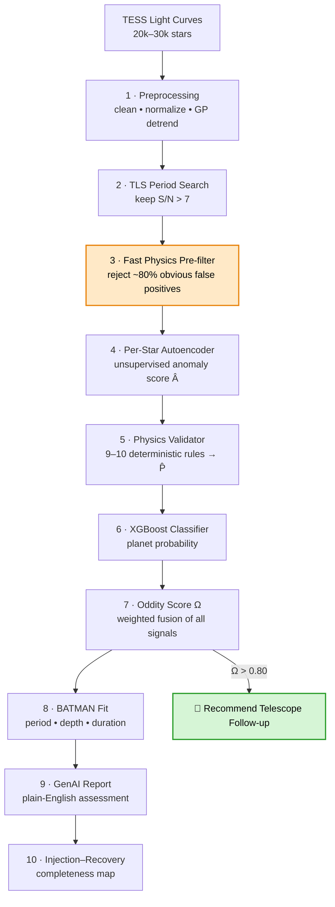

<div align="center">

# 🪐 PHAST
### Physics-Hardcoded Anomaly & Signal Taxonomy

**An automated, explainable pipeline that hunts for exoplanets in TESS light curves — by combining unsupervised AI, hard physics, and supervised learning into a single auditable verdict.**


</div>

---

## The Problem

Space telescopes like **TESS** stare at tens of thousands of stars at once and record how their brightness changes over time. When a planet passes in front of its star, the star dims by a fraction of a percent for a few hours — a *transit*. Find that dip, and you've found a world.

The catch: the data is a mess of star-spots, cosmic rays, spacecraft wobble, and instrument drift, and there are **millions of light curves**. No human can review them all. What's needed is a system that is **automated** (no human in the loop), **explainable** (it can say *why* it flagged something), and **scalable** (it runs on free hardware).

PHAST is that system.

---

## Why PHAST Is Different

Most detection pipelines lean on a single model and hand you a probability. PHAST makes three *independent* systems vote, then fuses them — and it does the cheap reasoning first.

🧠 **Three independent judges, one verdict.** An unsupervised autoencoder ("is this dip weird for *this* star?"), a deterministic physics validator ("does it obey orbital mechanics?"), and a supervised classifier ("does it look like known planets?"). Because their failure modes are uncorrelated, fusing them catches false positives that any one alone would miss.

⚡ **Physics before the heavy AI.** The core architectural move: a millisecond-fast physics pre-filter runs *before* the expensive per-star autoencoders. It throws out the obvious eclipsing binaries first, so we train autoencoders on ~200–400 clean candidates instead of ~1,000–2,000 — roughly **5× less compute**, and cleaner unsupervised learning.

🔍 **Auditable by design.** Every rejection comes with a reason. A signal isn't just "0.31 probability" — it's "rejected: secondary eclipse detected at phase 0.5." That's the difference between a black box and an instrument a scientist can trust.

💸 **Zero infrastructure cost.** Every component is free and open-source and runs end-to-end on a single Google Colab T4 GPU.

---

## Pipeline at a Glance



### The detection funnel

Each stage is a sieve. Tens of thousands of stars become a handful worth a telescope's time.

| Stage | Candidates remaining |
|---|---|
| Raw input | 20,000 – 30,000 stars |
| After TLS period search (S/N > 7) | 1,000 – 2,000 |
| After fast physics pre-filter | **200 – 400** |
| After autoencoder + physics validator | 50 – 150 |
| High-confidence (Ω > 0.80) | a handful → follow-up |

---

## How It Works — The 10 Stages

| # | Stage | In plain words |
|---|-------|----------------|
| 1 | **Preprocessing** | Download the data and scrub out spacecraft wobble, cosmic rays, and slow drift so only the star's real behavior remains. |
| 2 | **TLS Period Search** | Try thousands of candidate orbital periods; the right one makes all the dips stack up and line up. Uses a physically-shaped transit template, not a box. |
| 3 | **Fast Physics Pre-filter** ⚡ | In milliseconds, reject the obvious impostors (deep V-shaped eclipsing binaries, twin-eclipse pairs) using pure NumPy — *before* any ML runs. |
| 4 | **Per-Star Autoencoder** | Each star gets a personal model trained on its own normal behavior. A transit shows up as something the model can't reconstruct → high anomaly score Â. |
| 5 | **Physics Validator** | Ask 9–10 hard questions only a real planet can answer "yes" to at once (flat-bottomed dip, no secondary eclipse, odd/even depths equal…). Outputs a physics score P̂. |
| 6 | **XGBoost Classifier** | A supervised model trained on thousands of confirmed Kepler planets weighs ~25 features and estimates how planet-like the candidate is. |
| 7 | **Oddity Score Ω** | The weighted voting booth that fuses anomaly + physics + classifier + period-stability into one ranking number. |
| 8 | **BATMAN Fit** | Fit a gold-standard physical transit model to recover the headline numbers: orbital period, transit depth, duration — with uncertainties. |
| 9 | **GenAI Report** | A constrained, template-driven LLM turns 30+ raw numbers into a 3-sentence, plain-English assessment a scientist can read at a glance. |
| 10 | **Injection–Recovery** | Inject fake planets of known size into blank stars, run the whole pipeline, and measure exactly what fraction we recover. This is the pipeline's report card. |

### The Oddity Score

The final ranking fuses four independent signals:

```
Ω  =  0.35·Â  +  0.35·P̂  +  0.15·ClassifierProb  +  0.15·PeriodStability
```

| Symbol | Question it answers | Weight |
|---|---|---|
| **Â** | How unusual is this dip *for this specific star*? | 0.35 |
| **P̂** | Does it obey the laws of orbital mechanics? | 0.35 |
| **ClassifierProb** | Does it look like known planets? | 0.15 |
| **PeriodStability** | Is the period stable across every transit? | 0.15 |

Anomaly and physics carry the most weight because they're high-quality *and* independent of each other. The thresholds are actionable: **Ω > 0.80** → recommend follow-up, **0.50–0.80** → needs more data, **< 0.50** → reject. (Once injection–recovery gives us ground truth, these weights get tuned by grid search instead of being hand-set.)

---

## Validation: We Show a Completeness Map, Not Just "Accuracy"

Anyone can print a confusion matrix on a test set. PHAST reports the way NASA reports TESS itself — with a **completeness map**: a 2D grid of *transit depth vs. orbital period* showing exactly what fraction of injected planets we recover in each region.

> *Example:* "We recover **94%** of planets with depth > 0.1% and period < 10 days, and **61%** with depth > 0.05% and period < 20 days."

This treats the pipeline as a scientific instrument with known sensitivity limits — not a model with a single accuracy number — which is precisely what an operational survey needs.

---

## Tech Stack

| Component | Tool | Why |
|---|---|---|
| Data download | `lightkurve` | Official NASA tool; handles the MAST archive and TESS quality flags directly. |
| Detrending | `celerite2` (Gaussian Process) | Timescale-aware — separates slow stellar variability from hours-long transits. |
| Period search | `transitleastsquares` (TLS) | ~30% more sensitive than BLS for small planets (uses a real transit shape). |
| Autoencoder | `PyTorch` | Flexible training loops for stars with different amounts of clean baseline data. |
| Physics rules | `numpy` + `scipy` | No heavy dependencies, extremely fast, fully auditable. |
| Supervised classifier | `XGBoost` | Strong on small, tabular datasets where a CNN would overfit; gives feature importances. |
| Transit modeling | `batman` | Implements the Mandel–Agol equations — the standard in published exoplanet papers. |
| GenAI reports | `Gemini API` | Constrained, template-filled interpretation (kept on a tight leash to avoid hallucination). |
| Dashboard | `Streamlit` | Fast to build; clean scientific plots. |
| Compute | Google Colab T4 GPU | Free and sufficient for 200–400 per-star autoencoders. |

**Total infrastructure cost: ₹0.**

---

## Getting Started

### Run in Google Colab (recommended)

1. Open `preprocessing.ipynb` in [Google Colab](https://colab.research.google.com/) with a GPU runtime.
2. Install the libraries:
   ```bash
   pip install lightkurve celerite2 transitleastsquares xgboost batman-package torch
   ```
3. Set your target in the central config and run:
   ```python
   PIPELINE_CONFIG = {
       "target":  "TIC 261136679",   # Pi Mensae — a confirmed TESS planet host
       "sector":  1,
       "author":  "SPOC",
       "cadence": "short",           # 2-minute cadence
       # ... cleaning, gap, and GP-detrending settings
   }
   ```
4. Choose which stages to run, then go:
   ```python
   STAGES_TO_RUN = ["stage1"]        # grows to ["stage1", "stage2", ...] as you build
   ```

Stage outputs are checkpointed to disk, so you never recompute a finished stage while developing the next one.

---

## Project Structure

```
exoplanet-phast/
├── notebooks/
│   ├── stage1_preprocessing.ipynb         # main notebook: config, stage controls, orchestration
│   ├── stage1_transit_search.ipynb 
│   └── ...  
├── code/
│   ├── stage1_preprocessing.py   # Stage 1 — ingestion, cleaning, GP detrending
│   ├── stage2_tls_search.py      # Stage 2 — TLS period search        (in progress)
│   └── ...                        # Stages 3–10                         (in progress)
├── data/                         # downloaded TESS light curves
├── checkpoints/                  # per-stage saved outputs
├── plots/                        # diagnostics & completeness maps
└── README.md
```

---

## Roadmap

- [x] **Stage 1** — Data ingestion & preprocessing (download → quality clean → normalize → gap-aware GP detrend), with validation, metrics, and checkpointing
- [ ] **Stage 2** — TLS period search + parallel execution
- [ ] **Stage 3** — Fast physics pre-filter
- [ ] **Stage 4** — Per-star autoencoders
- [ ] **Stage 5** — Deterministic physics validator
- [ ] **Stage 6–7** — XGBoost classifier + Oddity Score fusion
- [ ] **Stage 8** — BATMAN parameter estimation
- [ ] **Stage 9** — GenAI interpretation layer
- [ ] **Stage 10** — Injection–recovery & completeness map
- [ ] Streamlit dashboard

---

## Acknowledgments

- **NASA / MAST** for open TESS data, and the **lightkurve** team for the tooling.
- **Hippke & Heller** for `transitleastsquares`, and **Kreidberg** for `batman`.
- Built toward the goals of ISRO's future exoplanet science (e.g. the **ExoWorlds** vision): automated, explainable, scalable detection.

---

## License

Released under the MIT License — see `LICENSE`.

<div align="center">

*Finding new worlds in the noise.*

</div>
